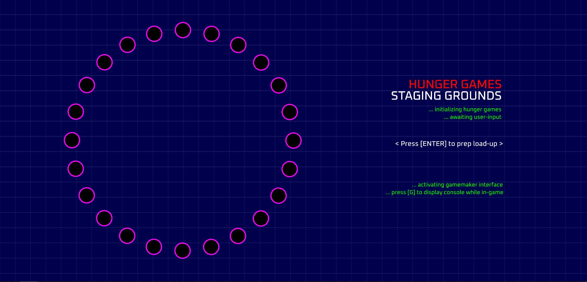
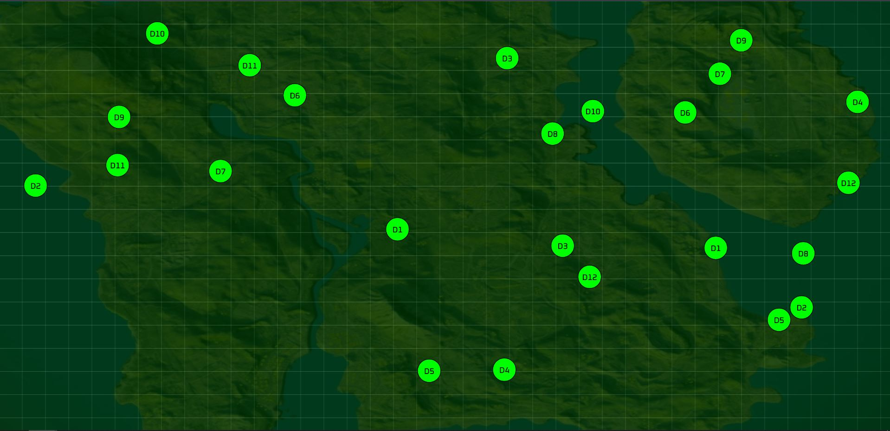
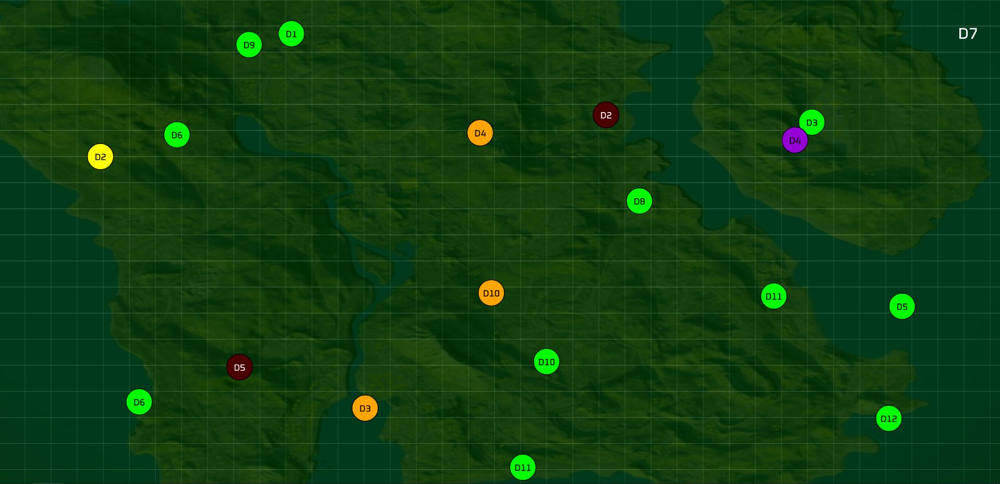
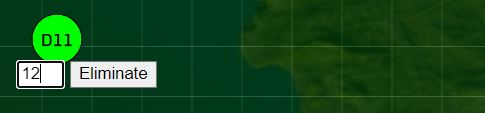
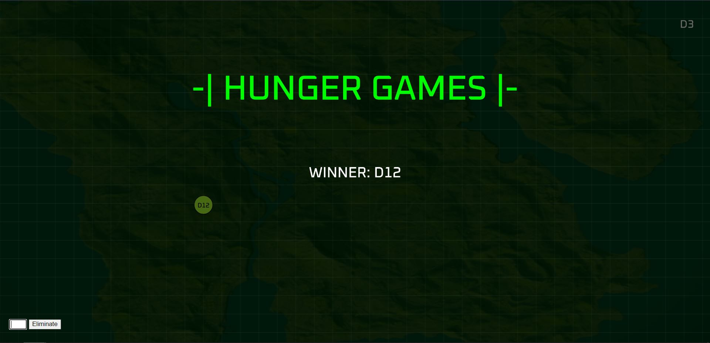

# HUNGER GAMES
▶️▶️ **Technologies Used:** JavaScript, p5.js

### PART 1 - THE CONCEPT
I've chosen to depict the concept of ***The Hunger Games***, a series of novels by Suzanne Collins.

*The Hunger Games* universe is a dystopia set in Panem, a North American country consisting of the wealthy Capitol, and 13 districts in varying states of poverty. Every year, children from the first 12 districts are selected via lottery to participate in a mandatory & televised battle-royale deathmatch called The Hunger Games.

 

In the novel (and the movie adaptations), these "Games" are designed by someone called the "Gamemaker", a highly coveted title, and personally hand-picked by the President of Panem. My idea is something along the lines of this:

The user interacting with this project is the *Gamemaker*, and they'll be "tracking" everything via this interface or ***interactive*** dashboard. I've developed a version that would replicate the original's feel, and also bring forth the battle-royale aspect of it.

### PART 2 - THE SETUP
The "tributes" start off in a circle (as they do in the books/movies), and wander about the canvas in a random fashion.

 
Figure 2.1: "Tributes" Starting-off Position 

Additionally, a time-based traversing method would be implemented, i.e. the positions of "tributes" (represented by ellipses) gets updated after each passing second, mimicking a radar/sonar map.

 
Figure 2.2: Rough Digital Sketch of Project Implementation 

### PART 3 - THE GAMEPLAY

The game begins with the "Staging Grounds" screen wherein all the "tributes" (denoted by ellipses) are arranged in a circular fashion. The game awaits the user's input to initiate the countdown. This part in itself was quite challenging because of the circular arrangement. After countless tries with *translate()* and *rotate()*, I ultimately decided to configure the canvas into WEBGL mode. This made p5.js set its (0,0) coordinate to the center of the screen.

 
Figure 3.1: Live Screenshot of the Staging Grounds 

User interaction is in the form of keyboard presses **and** mouse click to commence the Game. The gameplay consists of 24 tributes (2 from each district) battling it out in a battle-royale deathmatch. I've coded the interface in such a way that it resembles a radar / GPS tracker. The tributes' position updates randomly with each passing second. To get the "flashing radar dot" effect, I've coded a functionality that makes the stroke turn white & bold every 5 seconds.

All tributes have randomly assigned starting positions, 'x' & 'y' velocities, and attacking points (how much damage they'll inflict to other tributes upon collision). Similarly, all tributes start off with their respective hitpoints / health as 100.

As the game progresses, and as collisions occur between tributes, their hitpoints are reduced depending on whom they collided with. A tribute gets eliminated once their hitpoints become 0. To depict this visually, I've coded a functionality wherein the tributes' color changes from green to dark red, depending on how much health they have remaining.

Furthermore, I've also coded in a section that checks and ignores collision occuring between "self", and also with tributes from the **same** district. Collision are depicted visually in the form of real-time short color changes, i.e. tributes would, for the duration of the collision, turn a dark purple hue and then change back to their respective colors based on their hitpoint values.

 
Figure 3.2: Live Screenshot of the Game
 
 

 
Figure 3.3: Dynamic Health Update (In-Game) 

In addition to the time-based gameplay elements, I wanted to make it more interactive as well. I coded in a feature that would enable an in-game "Gamemaker Console" that allows the user to override the gameplay mechanics, and have the selected tributes eliminated.

The console is a text field which takes the district number as its input, and eliminates the corresponding tribute, provided it's still active in the game and has not been previously eliminated.

 
Figure 3.4: Gamemaker Console 

When there are 2 tributes remaining at the end, I've implemented a logic that checks whether the remaining tributes are from the **same** district. If yes, then they both are crowned the "Victors", and the game stops. Otherwise, the last tribute remaining at the end is crowned the "Victor". The game stops the moment it detects only 1 tribute is remaining.

The winning district number is displayed in an overlay.

 
Figure 3.5: Victor of the Games 

To make the game feel more immersive and exciting, I've included a background score. Additionally, as in the book/movies, whenever a tribute is eliminated in-game, a canon sound is heard signifying the event. I've replicated that scenario with my code as well. Whenever a tribute gets eliminated, a canon sound clip plays in the background too.

The district number of the eliminated "tribute" is displayed in the top right-hand corner.