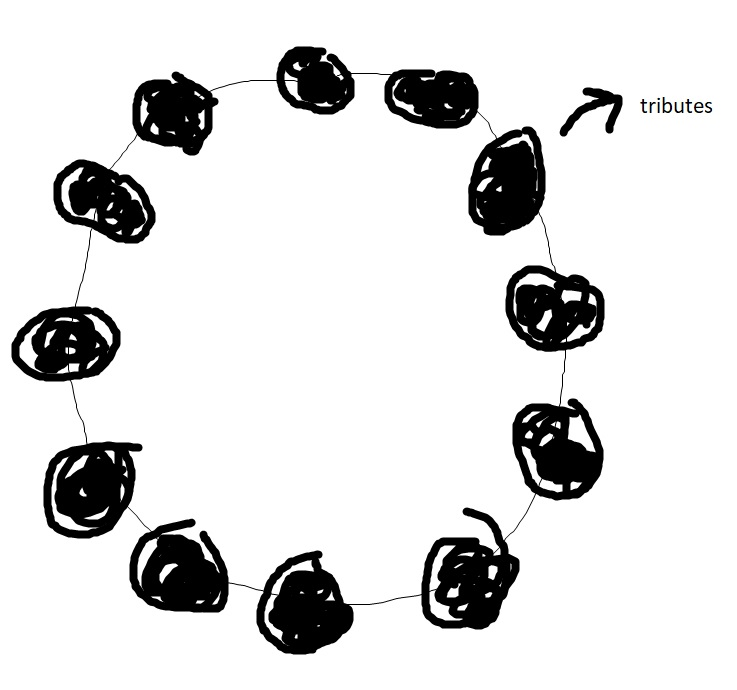
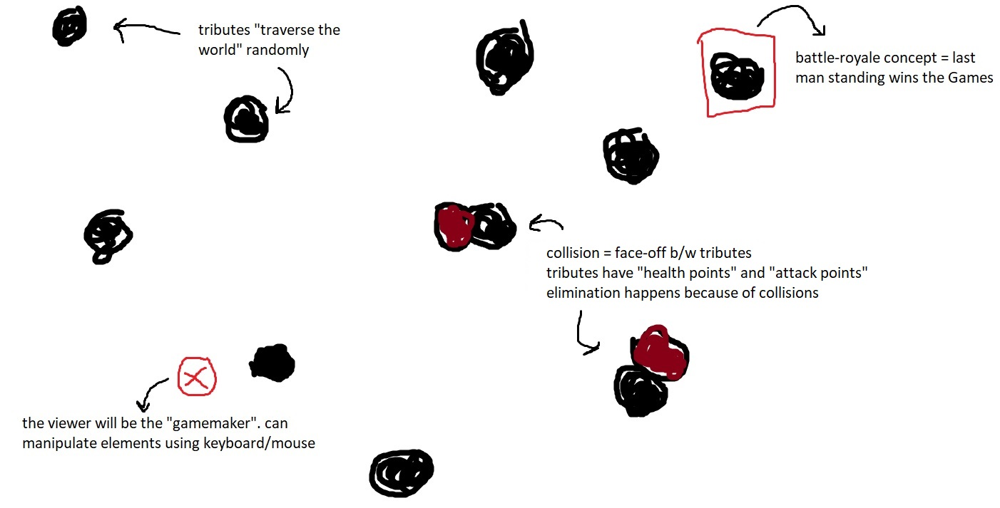

# HUNGER GAMES
▶️▶️ **Technologies Used:** JavaScript, p5.js

### PART 1 - THE CONCEPT
I've chosen to depict the concept of ***The Hunger Games***, a series of novels by Suzanne Collins via this project.

*The Hunger Games* universe is a dystopia set in Panem, a North American country consisting of the wealthy Capitol, and 13 districts in varying states of poverty. Every year, children from the first 12 districts are selected via lottery to participate in a mandatory & televised battle-royale death match called The Hunger Games.

 

In the novel (and the movie adaptations), these "Games" are designed by someone called the "Gamemaker", a highly coveted title, and personally hand-picked by the President of Panem. My idea is something along the lines of this:

The user interacting with this project is the *Gamemaker*, and they'll be "tracking" everything via this interface or ***interactive*** dashboard. I've developed a version that would replicate the original's feel, and also bring forth the battle-royale aspect of it.

### PART 2 - THE SETUP
The "tributes" start off in a circle (as they do in the books/movies), and wander about the canvas in a random fashion. I've implemented a time-based traversing method i.e. the positions of "tributes" (represented by ellipses) gets updated after each passing second, mimicking a radar/sonar map.

 
Figure 1.1: "Tributes" Starting-off Position 

 

 
Figure 1.2: Rough Digital Sketch of Project Implementation 
